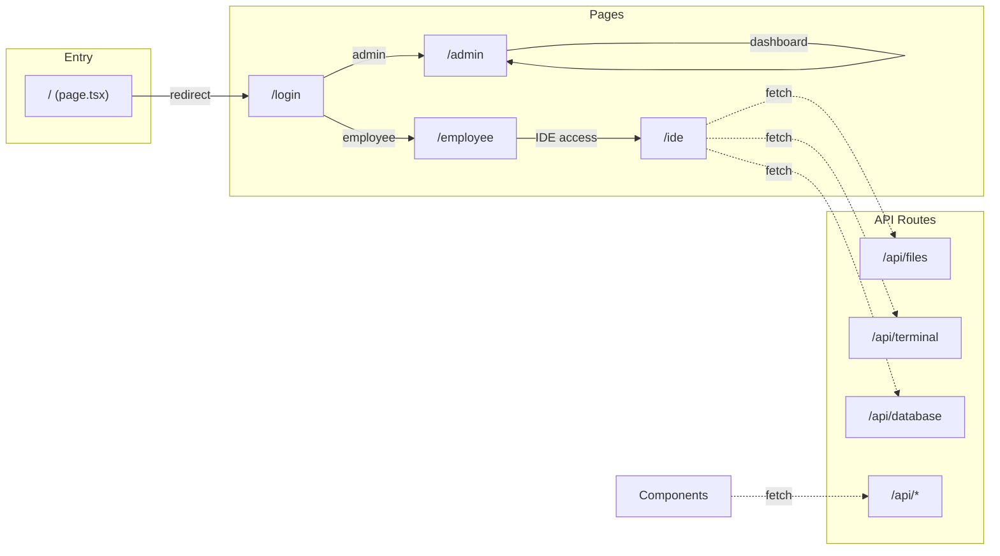
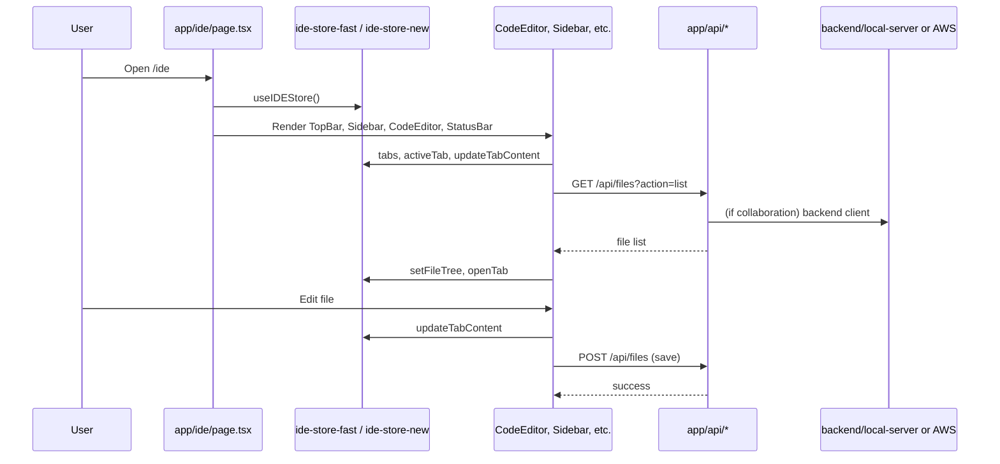
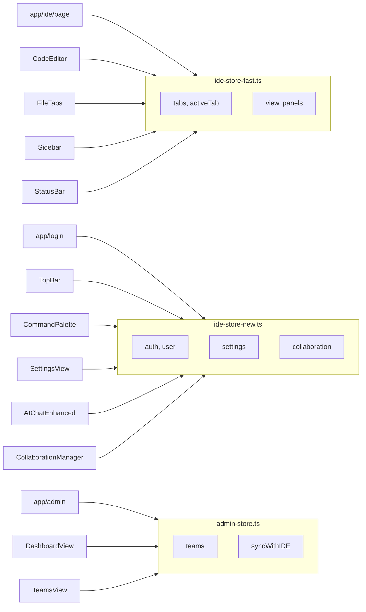

# KRIYA IDE – Architecture Flow & File Map

This document describes the application architecture, data flow, and the role of each major file and folder.

---

## 1. High-Level Architecture

```
┌─────────────────────────────────────────────────────────────────────────────┐
│                              USER (Browser)                                  │
└─────────────────────────────────────────────────────────────────────────────┘
                    │
                    ▼
┌─────────────────────────────────────────────────────────────────────────────┐
│  NEXT.JS FRONTEND (app/, components/, stores/, hooks/, lib/)                 │
│  • Pages: / → /login → /admin | /employee | /ide                             │
│  • API Routes: /api/files, /api/terminal, /api/database, ...                 │
│  • State: Zustand (ide-store-fast, ide-store-new, admin-store)               │
└─────────────────────────────────────────────────────────────────────────────┘
                    │                    │
                    │ REST /api/*        │ WebSocket / collaboration
                    ▼                    ▼
┌──────────────────────────────────┐  ┌──────────────────────────────────────┐
│  NEXT.JS API ROUTES (app/api/)   │  │  COLLABORATION BACKEND                │
│  • File ops → workspace/        │  │  • Local: backend/local-server.js     │
│  • Terminal, DB, deploy, etc.    │  │  • AWS: backend/main/ + aws-websocket/ │
└──────────────────────────────────┘  └──────────────────────────────────────┘
                    │                    │
                    ▼                    ▼
┌──────────────────────────────────┐  ┌──────────────────────────────────────┐
│  WORKSPACE (files)                │  │  DOCUMENTS / SESSIONS               │
│  • workspace/ (user files)       │  │  • Local: backend/data/              │
│  • data/ (collections, envs)      │  │  • AWS: DynamoDB                     │
└──────────────────────────────────┘  └──────────────────────────────────────┘
```

---

## 2. Mermaid Diagrams

### 2.1 Current File Structure (Tree)

```mermaid
flowchart TB
    subgraph ROOT["KRIYA (root)"]
        MID[middleware.ts]
        PKG[package.json, tsconfig, next.config, tailwind.config]
    end

    subgraph APP["app/"]
        LAY[layout.tsx, globals.css, page.tsx]
        LOGIN["login/page.tsx"]
        ADMIN["admin/page.tsx"]
        EMP["employee/page.tsx"]
        IDE["ide/page.tsx"]
        subgraph API["api/"]
            AUTH["auth/route.ts"]
            FILES["files/route.ts"]
            TERM["terminal/route.ts"]
            DB["database/route.ts"]
            DEPLOY["deploy/route.ts"]
            EXEC["execute/route.ts"]
            SEARCH["search/route.ts"]
            EXT["extensions/route.ts"]
            COLL["collections/"]
            GIT["git/init/route.ts"]
            DEV["dev/start/route.ts"]
            OTH["... (install, packages, proxy, server, debug, environments)"]
        end
    end

    subgraph COMP["components/"]
        IDE_COMP["CodeEditor, FileTabs, Sidebar, TopBar, StatusBar"]
        FEAT["CommandPalette, Terminal, AIChat, SettingsView"]
        ADMIN_COMP["admin/ AdminLayout, DashboardView, TeamsView"]
        EMP_COMP["employee/ EmployeeLayout"]
        AUTH_COMP["auth/ AuthGuard"]
    end

    subgraph STORES["stores/"]
        FAST["ide-store-fast.ts"]
        NEW["ide-store-new.ts"]
        LEGACY["ide-store.ts"]
        ADM["admin-store.ts"]
        SLICES["slices/ editor, ui, auth, database, api, settings"]
    end

    subgraph LIB["lib/"]
        BACK["backend-client.ts"]
        COLLAB["collaboration-service.ts"]
        FILE["file-tree.ts, file-system.ts"]
        DB_LIB["database-manager.ts, database-service.ts"]
        EXT_LIB["extension-manager.ts, extension-service.ts"]
        TEAM["team-service.ts"]
        UTIL["utils.ts, rate-limit.ts"]
    end

    subgraph HOOKS["hooks/"]
        HOT["useIDEHotkeys.ts"]
        COLLAB_H["useCollaborativeEditor.ts"]
    end

    subgraph BACKEND["backend/"]
        LOCAL["local-server.js"]
        MAIN["main/ server.js, api.js, websocket.js"]
        AWS["aws-websocket/ CDK, lambda/"]
    end

    subgraph OTHER["Other"]
        PUBLIC["public/"]
        DATA["data/ api-collections, api-environments"]
        DOCS["docs/"]
        SCRIPTS["scripts/"]
        WORKSPACE["workspace/"]
        TYPES["types/"]
        TEST["test/"]
    end

    ROOT --> APP
    ROOT --> COMP
    ROOT --> STORES
    ROOT --> LIB
    ROOT --> HOOKS
    ROOT --> BACKEND
    ROOT --> OTHER
```



### 2.2 Page & Route Flow



### 2.3 Data Flow (IDE Screen)



### 2.4 Store Usage Map



---

## 3. File & Folder Responsibility Map

### 3.1 Root

| File / Folder      | Purpose |
|--------------------|--------|
| `middleware.ts`    | Next.js middleware; sets CORS headers for `/api/*`. |
| `package.json`     | Dependencies and npm scripts (dev, build, start, lint). |
| `tsconfig.json`    | TypeScript config; path alias `@/*` → root. |
| `next.config.js`   | Next.js config (e.g. eslint ignore). |
| `tailwind.config.js` | Tailwind theme and content paths. |
| `postcss.config.js`  | PostCSS (Tailwind). |
| `next-env.d.ts`    | Next.js type references. |
| `vercel.json`      | Vercel deployment config. |
| `amplify.yml`      | AWS Amplify build config. |

---

### 3.2 app/ (Next.js App Router)

| Path | Purpose |
|------|--------|
| **app/layout.tsx** | Root layout: fonts, metadata, global wrapper. |
| **app/page.tsx** | Home `/`: redirects to `/login`. |
| **app/globals.css** | Global styles. |
| **app/favicon.ico** | Favicon. |
| **app/login/page.tsx** | `/login`: role selection (admin/employee), email/password, calls `ide-store-new` login, then redirects to `/admin` or `/employee`. |
| **app/admin/page.tsx** | `/admin`: uses `admin-store`, renders AdminLayout with DashboardView, TeamsView, ActivityView, Settings placeholder. |
| **app/employee/page.tsx** | `/employee`: renders EmployeeLayout (gateway to IDE features). |
| **app/ide/page.tsx** | `/ide`: main IDE; uses `ide-store-fast`, lazy-loads Sidebar, CodeEditor, FileTabs, TopBar, StatusBar, CommandPalette, AIChat, Terminal, Toast; switches MainContent by view (deploy, db, logs, settings, editor). |
| **app/docs/** | In-app docs (if any). |

---

### 3.3 app/api/ (API Routes)

Each folder under `app/api/` corresponds to a route segment. The handler is in `route.ts` (GET/POST/PUT/DELETE).

| Route Segment | File | Purpose |
|---------------|------|--------|
| **auth** | `app/api/auth/route.ts` | Authentication (e.g. session/token). |
| **files** | `app/api/files/route.ts` | List workspace files, read file, create/update/delete/rename; uses `workspace/` on disk; path validation and size limits. |
| **terminal** | `app/api/terminal/route.ts` | Run shell commands. |
| **database** | `app/api/database/route.ts` | DB operations; uses `lib/database-manager`. |
| **deploy** | `app/api/deploy/route.ts` | Deployment actions. |
| **execute** | `app/api/execute/route.ts` | Execute code. |
| **search** | `app/api/search/route.ts` | Global search. |
| **extensions** | `app/api/extensions/route.ts` | Extensions; uses `lib/extension-manager`. |
| **packages** | `app/api/packages/route.ts` | Package listing/operations. |
| **install** | `app/api/install/route.ts` | Install packages. |
| **proxy** | `app/api/proxy/route.ts` | Proxy HTTP requests. |
| **server** | `app/api/server/route.ts` | Server control/status. |
| **debug** | `app/api/debug/route.ts` | Debug actions. |
| **environments** | `app/api/environments/route.ts` | API environment config. |
| **collections** | `app/api/collections/route.ts`, `app/api/collections/[id]/route.ts` | API collections CRUD. |
| **git/init** | `app/api/git/init/route.ts` | Initialize git repo in a path. |
| **dev/start** | `app/api/dev/start/route.ts` | Start dev server (e.g. npm run dev) in a path. |

---

### 3.4 components/

| Component | Purpose |
|-----------|--------|
| **TopBar** | Top bar: logo, file name, Solo/Live toggle, collaboration status, backend status. Uses `ide-store-new`, `collaboration-service`. |
| **Sidebar** | Left sidebar: file tree, panels. Uses `ide-store-fast`, `file-tree`. |
| **FileTabs** | Open file tabs; add/close/switch. Uses `ide-store-fast`. |
| **CodeEditor** | Monaco editor; current tab content, save (⌘S). Uses `ide-store-fast`. |
| **StatusBar** | Bottom bar: cursor, backend status. Uses `ide-store-fast`. |
| **CommandPalette** | ⌘K command palette. Uses `ide-store-new`. |
| **Terminal** | Integrated terminal panel. Uses `ide-store-new`. |
| **AIAssistant** | AI assistant trigger (⌘I). Uses `ide-store-new`. |
| **AIChatEnhanced** | AI chat panel. Uses `ide-store-new`. |
| **AIChatPanel** | AI chat UI. Uses `ide-store-new`. |
| **SettingsView** | Settings screen (font, theme, etc.). Uses `ide-store-new`. |
| **SettingsPanel** / **SettingsModal** | Settings UI pieces. |
| **DeploymentDashboard** | Deploy view. Uses `ide-store-new`. |
| **DatabaseView** | Database browser. Uses `ide-store-new`. |
| **LogsView** | Logs viewer. |
| **CollaborationManager** | Collaboration UI. Uses `ide-store-new`, `collaboration-service`. |
| **CollaborationStatus** | Collaboration status indicator. |
| **CollaborationToggle** | Solo/Live toggle. |
| **GlobalSearch** | Global search UI. Uses `ide-store-new`. |
| **DebugPanel** | Debug panel. Uses `ide-store-new`. |
| **PerformanceMonitor** | Performance metrics. |
| **SystemStatus** | System/backend status. |
| **FileCreator** / **NewFileDialog** | Create new file. |
| **FolderCreator** / **NewFolderDialog** | Create new folder. |
| **YamlEditor** | YAML editing. |
| **Logo** | App logo. |
| **ErrorBoundary** | React error boundary. |
| **Toast** | Toast notifications. |
| **LoadingScreen** | Loading state. |
| **IDELayout** | IDE layout wrapper. |
| **MainEditor** | Editor + tabs wrapper. |
| **AnalyticsView** | Analytics view. |
| **admin/AdminLayout** | Admin layout and nav. |
| **admin/DashboardView** | Admin dashboard. |
| **admin/TeamsView** | Teams list/detail. |
| **admin/ActivityView** | Activity feed. |
| **admin/StatsCard** | Stat card. |
| **admin/InviteUserModal** | Invite user modal. |
| **employee/EmployeeLayout** | Employee layout and nav. |
| **auth/AuthGuard** | Protects routes; uses `ide-store-new` auth. |

---

### 3.5 stores/

| File | Purpose |
|------|--------|
| **ide-store-fast.ts** | Core IDE state: tabs, activeTab, file tree, view, panels, sidebar, terminal, modals; used by IDE page, CodeEditor, FileTabs, Sidebar, StatusBar. Optimized for frequent updates. |
| **ide-store-new.ts** | Auth (user, login, logout), settings, collaboration (aiChatOpen, etc.), used by login, admin, employee, TopBar, CommandPalette, Settings, AIChat, Collaboration*. |
| **ide-store.ts** | Legacy/combined store; composes editor + UI slices; used by `useIDEHotkeys`. |
| **admin-store.ts** | Teams, syncWithIDE, refreshTeams; used by admin page and admin components. |
| **store.ts** | Combined store from slices (editor-slice, ui-slice) with persist + devtools. |
| **slices/editor-slice.ts** | Editor state (tabs, recent files, fontSize, tabSize, etc.). |
| **slices/ui-slice.ts** | UI state (view, activePanel, terminalOpen, etc.). |
| **slices/auth-slice.ts** | Auth slice. |
| **slices/database-slice.ts** | Database slice. |
| **slices/api-slice.ts** | API slice. |
| **slices/settings-slice.ts** | Settings slice. |
| **hooks.ts** | Store-related hooks. |
| **utils.ts** | Store helpers. |

---

### 3.6 lib/

| File | Purpose |
|------|--------|
| **backend-client.ts** | Single backend client: API URL + WebSocket URL from env; methods: createDocument, getDocument, listDocuments, connect, joinDocument, sendOperation, sendCursorUpdate. |
| **collaboration-service.ts** | Real-time collaboration: connect, joinDocument, sendOperation, updateCursor; uses localStorage for multi-tab sync (or Socket.IO when wired to backend). |
| **operational-transform.ts** | OT types and helpers for conflict-free collaborative editing. |
| **file-tree.ts** | File tree types and helpers (e.g. FileTreeManager, FileTreeNode). |
| **file-system.ts** | Local file system helpers. |
| **file-types.ts** | File extension / type helpers. |
| **api-file-system.ts** | File operations via app API (fetch to /api/files). |
| **api-service.ts** | Generic API request helpers. |
| **database-manager.ts** | DB connection, getTables, executeQuery, closeConnection; used by app/api/database. |
| **database-service.ts** | Higher-level database service. |
| **team-service.ts** | Team CRUD; used by admin-store. |
| **extension-manager.ts** | Extension lifecycle; used by app/api/extensions. |
| **extension-service.ts** | Extension discovery/loading. |
| **auth-service.ts** | Auth helpers. |
| **utils.ts** | General utilities. |
| **rate-limit.ts** | Rate limiting. |
| **debug-service.ts** | Debug helpers. |

---

### 3.7 hooks/

| File | Purpose |
|------|--------|
| **useIDEHotkeys.ts** | Registers IDE hotkeys (⌘K, ⌘S, etc.); uses `ide-store`. |
| **useCollaborativeEditor.ts** | Hook for collaborative editing; uses `collaboration-service`. |

---

### 3.8 types/

| File | Purpose |
|------|--------|
| **auth.ts** | Auth-related TypeScript types. |

---

### 3.9 backend/

| Path | Purpose |
|------|--------|
| **local-server.js** | Express + Socket.IO server on port 8080; document CRUD, collaboration sessions, health at `/health`; stores docs in `backend/data/`. |
| **main/server.js** | Production server with AWS SDK (DynamoDB), JWT, rate limit, CORS; used with Serverless. |
| **main/api.js** | REST handlers for documents. |
| **main/websocket.js** | WebSocket handlers for collaboration. |
| **aws-websocket/bin/app.ts** | CDK app entry. |
| **aws-websocket/lib/kriya-websocket-stack.ts** | CDK stack: WebSocket API, Lambda, DynamoDB. |
| **aws-websocket/lambda/connect.js** | Lambda: WebSocket connect. |
| **aws-websocket/lambda/disconnect.js** | Lambda: WebSocket disconnect. |
| **aws-websocket/lambda/message.js** | Lambda: WebSocket message (e.g. join-document, operation, cursor-update). |
| **data/** | Local document storage (JSON). |
| **docs/** | Backend-specific docs. |
| **logs/** | Log files. |

---

### 3.10 Other Folders

| Path | Purpose |
|------|--------|
| **public/** | Static assets (logo, fonts). |
| **data/api-collections/** | API collection definitions. |
| **data/api-environments/** | API environment configs. |
| **docs/** | Project docs: ARCHITECTURE.md, README.md, setup/, architecture/, archive/. |
| **scripts/** | `start-full-stack.sh`, `deploy-aws.sh`, `deploy-backend.sh`, `deploy-production.sh`. |
| **workspace/** | Runtime user workspace (files edited in IDE); also sample/demo files. |
| **server/** | Optional YJS server (`yjs-server.js`). |
| **test/** | Tests (e.g. extension-service.test.ts). |

---

## 4. Request Flow Examples

### 4.1 Open file and edit

1. User opens `/ide` → `app/ide/page.tsx` renders with `ide-store-fast`.
2. Sidebar calls `/api/files?action=list` → `app/api/files/route.ts` reads `workspace/` and returns tree.
3. User clicks a file → store opens tab, CodeEditor loads content via `/api/files?path=...`.
4. User types → `updateTabContent` in store; on save (⌘S), CodeEditor triggers POST `/api/files` with path and content.
5. `app/api/files/route.ts` writes to `workspace/` and returns success.

### 4.2 Collaboration (Solo / Live)

1. TopBar shows Solo/Live; user toggles to Live.
2. Frontend uses `lib/collaboration-service` (and optionally `lib/backend-client`) to connect to WebSocket (local-server or AWS).
3. `joinDocument` is sent with document id; backend syncs operations and cursors.
4. CodeEditor sends operations via `collaboration-service.sendOperation` and cursor via `updateCursor`; other clients receive them and apply via OT.

### 4.3 Admin dashboard

1. User logs in as admin → redirect to `/admin`.
2. `app/admin/page.tsx` uses `admin-store` (teams, syncWithIDE, refreshTeams).
3. Renders AdminLayout with DashboardView, TeamsView, ActivityView.
4. Team data can come from `lib/team-service` and/or API; syncWithIDE keeps admin view in sync with IDE state.

---

## 5. Diagram: Current File Structure (ASCII)

```
KRIYA/
├── app/
│   ├── layout.tsx          # Root layout, fonts, metadata
│   ├── page.tsx            # / → redirect to /login
│   ├── globals.css
│   ├── favicon.ico
│   ├── login/page.tsx      # /login (role + auth)
│   ├── admin/page.tsx      # /admin (dashboard, teams, activity)
│   ├── employee/page.tsx   # /employee (EmployeeLayout)
│   ├── ide/page.tsx        # /ide (main IDE)
│   ├── docs/               # In-app docs
│   └── api/                # API routes
│       ├── auth/route.ts
│       ├── files/route.ts       # Workspace file CRUD
│       ├── terminal/route.ts
│       ├── database/route.ts
│       ├── deploy/route.ts
│       ├── execute/route.ts
│       ├── search/route.ts
│       ├── extensions/route.ts
│       ├── packages/route.ts
│       ├── install/route.ts
│       ├── proxy/route.ts
│       ├── server/route.ts
│       ├── debug/route.ts
│       ├── environments/route.ts
│       ├── collections/route.ts
│       ├── collections/[id]/route.ts
│       ├── git/init/route.ts
│       └── dev/start/route.ts
│
├── components/             # React UI
│   ├── TopBar.tsx
│   ├── Sidebar.tsx
│   ├── FileTabs.tsx
│   ├── CodeEditor.tsx
│   ├── StatusBar.tsx
│   ├── CommandPalette.tsx
│   ├── Terminal.tsx
│   ├── AIChatEnhanced.tsx
│   ├── SettingsView.tsx
│   ├── DeploymentDashboard.tsx
│   ├── DatabaseView.tsx
│   ├── CollaborationManager.tsx
│   ├── admin/              # AdminLayout, DashboardView, TeamsView, ActivityView
│   ├── employee/           # EmployeeLayout
│   └── auth/                # AuthGuard
│
├── stores/
│   ├── ide-store-fast.ts   # IDE core (tabs, view, panels)
│   ├── ide-store-new.ts    # Auth, settings, collaboration
│   ├── ide-store.ts        # Legacy / hotkeys
│   ├── admin-store.ts      # Teams, sync
│   ├── store.ts            # Combined slices
│   └── slices/             # editor, ui, auth, database, api, settings
│
├── lib/                    # Services & utilities
│   ├── backend-client.ts   # Collaboration API + WebSocket
│   ├── collaboration-service.ts
│   ├── file-tree.ts
│   ├── file-system.ts
│   ├── database-manager.ts
│   ├── extension-manager.ts
│   ├── team-service.ts
│   └── ...
│
├── hooks/
│   ├── useIDEHotkeys.ts
│   └── useCollaborativeEditor.ts
│
├── types/
│   └── auth.ts
│
├── public/                 # Static assets
├── data/                   # api-collections, api-environments
├── backend/
│   ├── local-server.js     # Dev server (Express + Socket.IO)
│   ├── main/               # AWS serverless (server, api, websocket)
│   ├── aws-websocket/      # CDK + Lambda (connect, disconnect, message)
│   ├── data/               # Local document storage
│   └── docs/
│
├── docs/                   # Project documentation
│   ├── ARCHITECTURE.md
│   ├── ARCHITECTURE_FLOW.md (this file)
│   ├── README.md
│   ├── setup/
│   ├── architecture/
│   └── archive/
│
├── scripts/                # start-full-stack.sh, deploy-*.sh
├── workspace/              # User workspace (runtime files)
├── server/                 # Optional yjs-server.js
├── test/                   # Tests
├── middleware.ts
├── package.json
├── tsconfig.json
├── next.config.js
└── tailwind.config.js
```

---

## 6. Quick Reference: Where is X?

| I want to… | Look at |
|------------|--------|
| Change login or roles | `app/login/page.tsx`, `stores/ide-store-new.ts` |
| Change IDE layout | `app/ide/page.tsx`, `components/` (TopBar, Sidebar, CodeEditor, etc.) |
| Change file read/write | `app/api/files/route.ts`, `lib/file-tree.ts`, `lib/api-file-system.ts` |
| Change collaboration | `lib/collaboration-service.ts`, `lib/backend-client.ts`, `backend/local-server.js` |
| Change admin/teams | `app/admin/page.tsx`, `stores/admin-store.ts`, `lib/team-service.ts`, `components/admin/` |
| Add an API route | New folder under `app/api/<name>/route.ts` |
| Change state shape | `stores/ide-store-fast.ts`, `stores/ide-store-new.ts`, `stores/slices/*.ts` |
| Change backend URL | `lib/backend-client.ts`, env `NEXT_PUBLIC_API_URL`, `NEXT_PUBLIC_COLLABORATION_WS_URL` |
| Run full stack | `./scripts/start-full-stack.sh` |

---

*Last updated to match the current file structure and flows.*
